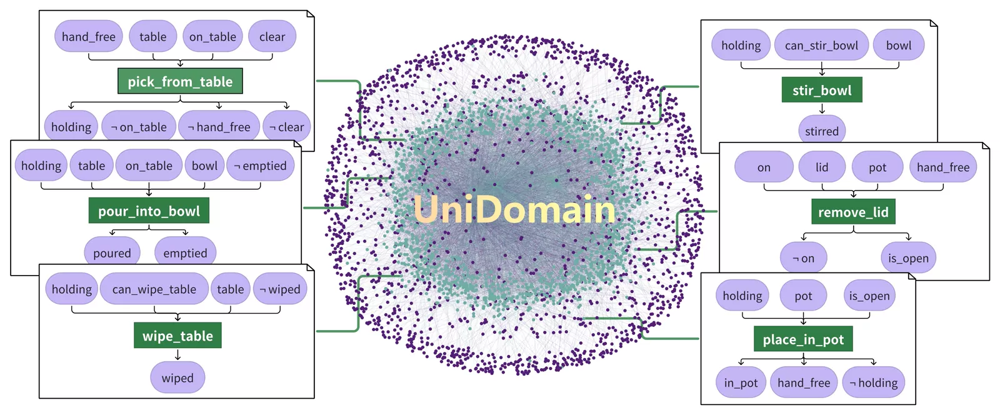

<div align="center">

<div align="center">
  
  <br>
  <em>UniDomain: Embodied Knowledge Graph. <br>Bridging the PDDL Universe with Real-World Wisdom.</em>
</div>

<br>

<h1 style="font-size: 3.5em; margin-bottom: 0px;">
  UniDomain
</h1>

<h2 style="font-size: 1.5em; font-weight: 600; margin-top: 10px;">
  Pretraining a Unified PDDL Domain from Real-World Demonstrations <br> 
  for Generalizable Robot Task Planning
</h2>

<p style="font-size: 1.4em; font-weight: bold; color: #555; margin-top: 5px;">
  NeurIPS 2025
</p>

[**Haoming Ye**](https://github.com/SII-Melancholy)<sup>1</sup>, [**Yunxiao Xiao**](https://github.com/ZetaXYX)<sup>1</sup>, [**Cewu Lu**](https://www.mvig.org/)<sup>2</sup>, [**Panpan Cai**](https://cindycia.github.io/)<sup>2</sup>

<sup>1</sup>Shanghai Innovation Institute, <sup>2</sup>Shanghai Jiao Tong University, <br>
<sup>3</sup>Beijing University of Posts and Telecommunications


<div align="center">
    <a href="https://roboticsjtu.github.io/UniDomain/">🌐 <b>Project Page</b></a> |
    <a href="https://roboticsjtu.github.io/Group_website/">🏛️ <b>Lab Website</b></a> |
    <a href="https://www.xiaohongshu.com/user/profile/67fc3c83000000000a03c1e7">📕 <b>Xiaohongshu</b></a> |
    <a href="https://m.bilibili.com/space/3546982243108982">📺 <b>Bilibili</b></a>
</div>

<br>

[](https://github.com/RoboticSJTU/UniDomain/actions/workflows/ci.yaml)
[](https://github.com/RoboticSJTU/UniDomain/pkgs/container/UniDomain)
[](https://arxiv.org/abs/2507.21545)
[](https://huggingface.co/datasets/SII-PrimoButterfly/UniDomain-Data)
[](https://github.com/RoboticSJTU/UniDomain/blob/main/LICENSE)

</div>

## 📑 Table of Contents

- [Introduction](#-introduction)
- [News](#-news)
- [Installation](#-installation)
  - [Configure Environment Variables](#1-configure-environment-variables-common)
  - [Local Installation](#-option-a-installation-from-source-locally)
  - [Docker](#-option-b-docker-support-recommended)
- [Data Preparation](#-data-preparation)
- [Quick Start](#-quick-start-tutorial--demo)
- [Phase 1: Pre-training (Tutorial)](#-phase-1-pre-training-tutorial)
  - [Step 1: Keyframe Extraction](#-step-1-keyframe-extraction)
  - [Step 2: Atomic Domain Generation](#-step-2-atomic-domain-generation)
  - [Step 3: Domain Fusion](#-step-3-domain-fusion)
- [Phase 2: Task Planning (Demo)](#-phase-2-task-planning-demo)
- [Benchmark & Baselines](#-benchmark--baselines)
- [Logging & Cost Tracking](#-logging--cost-tracking)
- [Advanced Configuration](#️-advanced-configuration)
- [API Reference & Data Formats](#-api-reference--data-formats)
  - [Batch Data Format](#data-format)
  - [Keyframes Module](#api-keyframe)
  - [Atomic Domain Module](#api-atomic)
  - [Domain Fusion Module](#api-fusion)
  - [Task Planner Module](#api-planner)
- [Citation](#-citation)
- [License](#-license)
- [Acknowledgement](#-acknowledgement)

## 📖 Introduction

**UniDomain** is a framework that pre-trains executable PDDL domains from large-scale robot manipulation videos. It extracts atomic domains from visual demonstrations and systematically fuses them into high-quality meta-domains, enabling zero-shot solution of complex, long-horizon tasks.


## 🔥 News

*   **[2025-12-05]** Code and Data released!
*   **[2025-09-18]** UniDomain is accepted to **NeurIPS 2025**!


## 🛠️ Installation

You can choose to install UniDomain locally or use Docker.

### 1. Configure Environment Variables (Common)
First, clone the repository and configure the environment variables.

```bash
git clone https://github.com/RoboticSJTU/UniDomain.git
cd UniDomain

# Create configuration file
cp .env.example .env
```

**Configure your `.env` file:**
```ini

# 1. LLM API Configuration, Choose ONE client type: "OpenAI" or "AzureOpenAI"
# --- Option A: Standard OpenAI (Default) ---
CLIENT_TYPE=OpenAI
API_KEY=your_openai_api_key
BASE_URL=https://api.openai.com/v1

# --- Option B: Azure OpenAI ---
# CLIENT_TYPE=AzureOpenAI
# API_KEY=your_azure_api_key
# BASE_URL=https://your-resource-name.openai.azure.com/
# API_VERSION=2025-01-01-preview


# 2. External Tools Configuration
# [Required] Fast Downward Path
# Required for: Atomic Domain Generation, Task Planner
# Point this to the 'fast-downward.py' executable script.
FAST_DOWNWARD_PATH=/path/to/fast-downward/fast-downward.py

# [Optional] Embedding Model Path
# Required for: Domain Fusion
# If commented out, the default model (sentence-transformers/all-mpnet-base-v2) 
# will be downloaded automatically from Hugging Face at runtime.
# EMBEDDING_MODEL_PATH=/path/to/local/embedding_model
```

### 2. Choose Installation Method
#### 📦 Option A: Installation from Source (Locally)

**Step 1: Python Environment**
```bash
conda create -n unidomain python=3.10 -y
conda activate unidomain

# Install package in editable mode
# (Recommended: changes to the code/config will apply immediately)
pip install -e .
```
**Step 2: External Tools (Optional based on usage)**
*   **Fast Downward** (Required for *Atomic Domain Generation* & *Task Planning* & *Baselines*):
    *   **Quick Install**:
        ```bash
        git clone https://github.com/aibasel/downward.git fast_downward
        cd fast_downward && ./build.py
        ```
    *   **Official Guide**: If the quick install fails (e.g., due to GCC/CMake issues), please follow the [official instructions](https://github.com/aibasel/downward).
    *   Add to `.env`: `FAST_DOWNWARD_PATH=/path/to/fast-downward/fast-downward.py`
*   **Graphviz** (Required for *Domain Fusion* visualization):
    *   Ubuntu: `sudo apt-get install graphviz`
    *   Mac: `brew install graphviz`
*   **FFmpeg** (Required only if extracting keyframes from *Videos*):
    *   Ubuntu: `sudo apt-get install ffmpeg`
*   **Embedding Models** (Required for *Domain Fusion*):
    *   By default, we use Sentence Transformer models. You can download them from [Hugging Face](https://huggingface.co/sentence-transformers/all-mpnet-base-v2) and add to `.env`: `EMBEDDING_MODEL_PATH=/path/to/embedding_models`
    *   If not set, Domain Fusion pipeline will download the default model automatically at the first run.
---

#### 🐳 Option B: Docker Support
We provide two Docker images with all system dependencies pre-installed:

- **GPU image:** `pytorch/pytorch:2.3.1-cuda12.1-cudnn8-runtime` (CUDA 12.1)
- **CPU image:** `python:3.10-slim-bookworm + torch==2.3.1 ` (CPU)

**Both images contain:**
- Fast Downward (already built, with FAST_DOWNWARD_PATH set)
- Graphviz (domain visualization)
- FFmpeg (video keyframe extraction)
- All Python dependencies for .[all]


**🖥️ Host requirements**

- **GPU image**
  - Linux host with **NVIDIA GPU**
  - Recent **NVIDIA driver** compatible with CUDA 12.1
  - **Docker** and **NVIDIA Container Toolkit** installed (so `docker run --gpus all` works)

- **CPU image**
  - Any Linux host with Docker installed
  - No GPU required

---

**Step 1: Get the Image**

*   **Method 1: Pull Pre-built Image**
    ```bash
    # Pull GPU image and tag it as "unidomain:gpu-latest"
    docker pull ghcr.io/roboticsjtu/unidomain:gpu-latest
    docker tag ghcr.io/roboticsjtu/unidomain:gpu-latest unidomain:gpu-latest
    
    # Pull CPU image and tag it as "unidomain:cpu-latest"
    docker pull ghcr.io/roboticsjtu/unidomain:cpu-latest
    docker tag ghcr.io/roboticsjtu/unidomain:cpu-latest unidomain:cpu-latest
    ```
*   **Method 2: Build Locally (optional)**
    ```bash
    # GPU image (local)
    docker build -t unidomain:gpu-latest -f docker/Dockerfile.gpu .

    # CPU image (local)
    docker build -t unidomain:cpu-latest -f docker/Dockerfile.cpu .
    ```

**Step 2: Run Container (Dev Mode, Mount Repo)**

We recommend mounting your entire repository into the container. This allows you to:

1.  **Persist Data:** Downloaded data and results are saved to your local disk.
2.  **Hot Reload:** Code changes on your host machine apply immediately.
3.  **Share Models:** Reuse your local Hugging Face cache.

```bash
# Run from the repository root

# GPU container
docker run -it --rm --gpus all \
    --ipc=host \
    -v "$(pwd)":/app \
    -v ~/.cache/huggingface:/root/.cache/huggingface \
    --env-file .env \
    -e FAST_DOWNWARD_PATH=/tools/fast_downward/fast-downward.py \
    unidomain:gpu-latest

# CPU container
docker run -it --rm \
    --ipc=host \
    -v "$(pwd)":/app \
    -v ~/.cache/huggingface:/root/.cache/huggingface \
    --env-file .env \
    -e FAST_DOWNWARD_PATH=/tools/fast_downward/fast-downward.py \
    unidomain:cpu-latest
```

> 💡 **Tip: Mounting `~/.cache/huggingface`**
>
> We mount `~/.cache/huggingface` so that Hugging Face models downloaded inside the container are:
> - **Persisted on the host** (not lost when the container exits), and  
> - **Reused across runs** (including between local runs and Docker runs).
>
> If you set a custom `EMBEDDING_MODEL_PATH` in `.env`, make sure the **corresponding directory is also mounted** into the container.  
> The `~/.cache/huggingface` mount is mainly for the default **“auto-download”** behavior.


---

## 📂 Data Preparation

Data is hosted on [Hugging Face](https://huggingface.co/datasets/SII-PrimoButterfly/UniDomain-Data). To save bandwidth and storage, we provide a script to download specific subsets.


| **Subset** | **Content Description** | **Download Command** |
| :--- | :--- | :--- |
| 🎓 **Tutorial** | Videos for the *Pre-training* tutorial. | `unidomain download tutorial` |
| 🤖 **Demo** | Meta-Domain & Overview Task for *Task Planning*. | `unidomain download meta` |
| 📊 **Tasks** | The **UniDomain-100** tasks used in the paper. | `unidomain download tasks` |
| 📈 **Results** | Evaluation logs & metrics (UniDomain vs Baselines). | `unidomain download results` |
| 📦 **Unified** | The full 13k Atomic Domains & final Unified Domain. | `unidomain download unified` |
| 🌍 **All** | Download **everything** listed above. | `unidomain download all` |


---


## ⚡ Quick Start (Tutorial & Demo)

After completing **Installation** (including `.env` and external tools such as Fast Downward) and skimming through **Data Preparation**, you can run the full UniDomain tutorial with:

```bash
# 1. Download the tutorial subset
unidomain download tutorial

# 2. Run the pre-training pipeline (Phase 1)
python examples/01_keyframes.py
python examples/02_atomic_domain.py
pip install -e .[fusion]
python examples/03_domain_fusion.py

# 3. Run the task-planning demo (Phase 2)
unidomain download meta
python examples/04_task_planner.py
```

📖 For detailed explanations of each step, see:
- [Data Preparation](#-data-preparation)
- [Phase 1: Pre-training (Tutorial)](#-phase-1-pre-training-tutorial)
- [Phase 2: Task Planning (Demo)](#-phase-2-task-planning-demo)

## 🚀 Phase 1: Pre-training (Tutorial)

This section demonstrates how to use the pre-training pipeline from scratch using the `tutorial` data.

**Prerequisite:** Download the tutorial data:
```bash
unidomain download tutorial
```

### 🎞️ Step 1: Keyframe Extraction
Compress raw videos into significant state transitions.
*   *Requirement:* `ffmpeg` (if input is video).

Firstly, let's extract keyframes from the 4 tutorial videos using example script below.

```bash
# Processing data/tutorial/videos -> outputs/01_keyframes
python examples/01_keyframes.py
```
> **Check Result:** Open `outputs/01_keyframes/` to see the extracted images.

> **Usage** Keyframe Extraction offers one Python API (and CLI command), supporting **multiple input formats (single video, directory of videos, image sequence, etc.)**. View Docs below for details.

> 📖 **Docs:** [Python API](#api-keyframe) | [CLI Arguments](#api-keyframe)

---

### 🧩 Step 2: Atomic Domain Generation
Generates PDDL atomic domain from keyframes via VLM & LLM refinement.
*   *Requirement:* The right `FAST_DOWNWARD_PATH` set in .env.

After obtaining 4 keyframe directories, we can generate 4 atomic domains in parallel using example script below.

```bash
# Processing outputs/01_keyframes -> outputs/02_atomic_domain
python examples/02_atomic_domain.py
```
> **Check Result:** Check `outputs/02_atomic_domain/`.

> **Usage** Atomic Domain Generation offers two Python APIs (and CLI commands), supporting running in **Single Mode and Batch Mode**. Batch Mode supports **resume**, requiring a JSON file as input. View Docs below for details.

> 📖 **Docs:** [Python API](#api-atomic) | [Batch Data Format](#data-format)

---


### 🌐 Step 3: Domain Fusion
Merges multiple atomic domains into a meta-domain.
If you need to run Domain Fusion pipeline, please run **`pip install -e .[fusion]`** to install torch and sentence-transformers first.
*   *Requirement:* `torch`, `Sentence Transformers`, `Graphviz`.
*   *Config:* Sets `EMBEDDING_MODEL_PATH` in `.env` to use a local model, otherwise downloads from HuggingFace automatically.

We can then fuse the 4 atomic domains into one single meta domain using example script below.

```bash
# Run the example script
python examples/03_domain_fusion.py
```
> **Check Result:**

> 1. `outputs/03_domain_fusion/6/meta_domain.pddl/json`: The final domain. The last domain (sixth in our tutorial) is the final fused meta domain.

> 2. `outputs/03_domain_fusion/binary_domain_fusion_tree.png`: Visualization of the merging process.

> **Usage** Domain Fusion offers one Python API (and CLI command), supporting **parallelism and resume**. View Docs below for details.

> 📖 **Docs:** [Python API](#api-fusion) | [Algorithm Details](#api-fusion)

---

## 🤖 Phase 2: Task Planning (Demo)
Solves a new downstream task using the fused Meta-Domain.

> **Note:** To demonstrate the full capability of the planner, we use the **official Meta-Domain** and **Overview Task** (as visualized in the paper's Figure 2) for this demo, rather than the minimal domain generated in the Phase 1 tutorial.

**Prerequisite:** Download the meta domain data:
```bash
unidomain download meta
```

*   *Requirement:* The right `FAST_DOWNWARD_PATH` set in .env.
*   *Note:* If **Fast Downward** is not configured, the planner will generate `domain.pddl` and `problem.pddl` in the output folder. You can manually copy them to [PDDL Editor](http://editor.planning.domains/) to find a solution.


We will solve the task: *Move the corn from the pot into the orange bowl, wipe the table with the towel in the yellow drawer and put it back to the closed yellow drawer.*.

```bash
# Run the planning demo
python examples/04_task_planner.py
```
> **Check Result:** `outputs/04_task_planner/overview_task/solution.txt` contains the generated plan (e.g., `remove_lid`, `pick_from_rack`).

> **Usage** Task Planner offers two Python APIs (and CLI commands), supporting running in **Single Mode and Batch Mode**. Batch Mode supports **resume**, requiring a JSON file as input. View Docs below for details.

> 📖 **Docs:** [Python API](#api-planner) | [Batch Data Format](#data-format)

---

## 📊 Benchmark & Baselines

**Prerequisite:** Download the official meta domain and tasks:
```bash
unidomain download meta
unidomain download tasks
```

### 1. Run Inference
We provide a pre-configured script to execute the **Task Planner** on the **UniDomain-100** benchmark tasks in parallel.
*   **Script:** [`scripts/run_tasks.py`](scripts/run_tasks.py)
*   **Usage:** The script is **commented out by default**. 
    1.  Open the file.
    2.  **Uncomment** the execution line.
    3.  Run:
```bash
python scripts/run_tasks.py
```

> **Note:** You can adjust `num_workers` inside the script to fit your **network bandwidth** and **API concurrency limits**.

### 2. Run Baselines
We provide implementations for six baseline methods. The execution logic is centralized in [`scripts/run_baselines.py`](scripts/run_baselines.py).

*   **Supported Methods:**
    *   **VLM-CoT**: Naive Chain-of-Thought planning.
    *   **VLM-CoT-PDDL**: One-shot PDDL generation.
    *   **CaP**: Code as Policies (adapted for VLM).
    *   **IVML**: Iterative Verbalized Machine Learning.
    *   **ISR-LLM**: Iterative Self-Refined LLM.
    *   **ReAct / Reflexion**: Interactive embodied agent.

*   **Usage:**
    The execution script is **commented out by default** to prevent accidental costs.
    1.  Open [`scripts/run_baselines.py`](scripts/run_baselines.py).
    2.  **Uncomment** the specific baseline function you want to run.
    3.  Execute:

```bash
python scripts/run_baselines.py
```

> **⚠️ Note on ReAct/Reflexion:**
> Since this baseline requires interactive hardware access (Camera & Display for human feedback) and loop execution, it does **not** support batch mode.
> *   **Install Dependencies:** `pip install -e .[baselines]` (requires `opencv-python`, etc.)
> *   **Environment:** We recommend running it locally. It is **NOT** supported in our default Docker environment (requires manual X11/Display forwarding configuration).


---

## 💰 Logging & Cost Tracking

Since UniDomain involves intensive LLM calls, we provide a dual-logging system in **each task directory** to help you track costs and debug prompts.

1.  **Where to check costs?**
    Check `llm_usage.log` in your output directory. It records the token usage, latency, and estimated cost (USD) for **every single API call**.

    ```text
    +-----------------------+--------------------------------------+
    |             Metric Record @ 2025-12-01 16:23:31              |
    |-----------------------+--------------------------------------|
    | call_id               | 270598cf-f996-48a5-a524-e1502fb2fe84 |
    | model_name            | gpt-4.1                              |
    | input_tokens          | 3297                                 |
    | output_tokens         | 305                                  |
    | thinking_time_seconds | 8.59                                 |
    | cost                  | 0.009034                             |
    | total_costs_to_now    | 0.016764                             |
    +-----------------------+--------------------------------------+
    ```

> **Note on Accumulation:** `total_costs_to_now` represents the cumulative cost recorded **within this specific log file only**. In **Batch Mode**, since tasks run in parallel and write to separate directories, this value reflects the cost for **that specific task**, not the global accumulation across all parallel workers.

> 💡 **Tip:** Copy the `call_id` to search in **`execution.log`** within the same directory. This allows you to view the exact **Input Prompt** and **LLM Response** corresponding to that cost.

2.  **How to customize model prices?**
    If OpenAI updates their pricing, or if you switch to a different model (e.g., Azure or other API models), you can update the unit prices in [`src/unidomain/configs/llm.py`](src/unidomain/configs/llm.py).
    ```python
    # Pricing Registry. Unit: USD per 1 Million tokens.
    # Format: "model_name": (Input Price, Output Price)
    # Note: These prices should be updated regularly as providers adjust rates.
    MODEL_COSTS = {
        "gpt-4o": (2.5, 10),
        "gpt-4.1": (2, 8),
        "o1": (15, 60),
        # ... add your custom model prices here
    }
    ```

---

## ⚙️ Advanced Configuration

The system is designed to be highly modular. You can extend core components by following the interface specifications below.

### 1. LLM Providers
By default, the system supports OpenAI and Azure OpenAI. To integrate **other closed-source APIs** (e.g., Claude, Gemini) or **local open-source models** (e.g., vLLM, Ollama):
*   **File:** [`src/unidomain/services/llm_agent.py`](src/unidomain/services/llm_agent.py)
*   **How to Modify:** Update the `setup_client` function or the `LLMAgent` class initialization to connect to your endpoint.
*   **⚠️ Constraint:** You must maintain the signature and return type of the **`LLMAgent.call`** method. It must accept a prompt (and optional images) and return a clean string (or list of strings).

### 2. Embedding Models
Used in the Domain Fusion pipeline for semantic similarity.

*   **Switch Open-Source Models:** Update `EMBEDDING_MODEL_PATH` in `.env`. You can specify either a **Hugging Face Model ID** (e.g., `sentence-transformers/all-MiniLM-L6-v2`, auto-downloaded) or a **Local Directory Path** (for offline use).
*   **Use Commercial APIs:** To use APIs like OpenAI Embeddings, modify [`src/unidomain/services/embedding.py`](src/unidomain/services/embedding.py).
*   **⚠️ Constraint:** The **`TextEmbeddingAPI.text_embedding`** method must accept a list of strings and return a **`numpy.ndarray`** (shape: `[N, dimension]`) for cosine similarity calculation.

### 3. Hyperparameters & Model Selection
All algorithmic parameters and **LLM assignments** are centralized in [`src/unidomain/configs/unidomain.py`](src/unidomain/configs/unidomain.py). You can tune:
*   **Keyframes:** `hyperparam_delta` (Sensitivity for frame extraction).
*   **Atomic Domain:** `refine_max_attempts` (Retry limit), `solvability_check_threshold`.
*   **Domain Fusion:** `predicate_threshold` & `operator_threshold` (Similarity cutoffs for merging).
*   **LLM Model Configuration:** You can specify different models (e.g., `gpt-4o`, `o1`) and sampling parameters (e.g., `temperature`) for each specific pipeline stage.
---

## 📚 API Reference & Data Formats

Detailed documentation for Python APIs and CLI commands.

<span id="data-format"></span>
### 1. Standardized Batch Data Format (`.json`)
All batch pipelines (Atomic Domain, Task Planner, Baselines) use this unified JSON structure.
*   **Keys**: Arbitrary unique identifiers (e.g., `"task_01"`). These keys determine the **output sub-directory names**.
*   **path**: Can be an **absolute path** or a **relative path** (relative to the JSON file's directory).

```javascript
{
    "unique_id_1": {
        "instruction": "Put the red block into the bowl",
        "path": "./keyframes/seq_01"  // Directory for Atomic, Image file for Planner
    },
    "unique_id_2": {
        "instruction": "Open the drawer",
        "path": "/absolute/path/to/data/seq_02"
    },
    ...
}
```
> **⚡ Auto-Resume:** All batch commands support state persistence. Re-running the command automatically skips completed tasks and resumes from the breakpoint, including Atomic Domain Generation, Domain Fusion, Task Planner, and Baselines (except for ReAct).

---

<span id="api-keyframe"></span>
### 2. Keyframes Module
Extracts significant states from video files or image sequences.

*   **Python API:**
    ```python
    from unidomain import keyframes_pipeline
    
    keyframes_pipeline(
        # Can be a single path, or a list of mixed paths
        input_paths=["data/video.mp4", "data/image_sequence_folder"],
        output_dir="path/to/save"
    )
    ```

*   **CLI Command:**
    ```bash
    unidomain keyframe -i <INPUT_PATHS> -o <OUTPUT_DIR>
    ```

#### 📥 Supported Input Formats
The pipeline automatically detects and processes the following structure types:

1.  **Single Video File**: Path to a video (e.g., `.mp4`, `.avi`).
2.  **Directory of Videos**: A folder containing multiple video files (Batch processing).
3.  **Image Sequence**: A folder containing sorted frame images (e.g., `00.jpg`, `01.jpg`...).
4.  **Directory of Sequences**: A folder containing sub-folders, where each sub-folder is an image sequence.
5.  **Mixed List**: A list containing any combination of the above (e.g., one video file + one sequence folder).

#### 🗂️ Output Artifacts
The output directory will contain sorted image files.
```text
output_dir/
├── video_filename_1/   # Extracted from video_filename_1.mp4
│   ├── 00000.jpg
│   ├── 00015.jpg
│   └── ...
└── sequence_folder_2/  # Selected from input sequence folder
    ├── ...
```

---

<span id="api-atomic"></span>
### 3. Atomic Domain Module
Generates PDDL domain from visual observations.

*   **Python API (Single Mode):**
    ```python
    from unidomain import atomic_domain_pipeline
    
    atomic_domain_pipeline(
        keyframes_dir="path/to/keyframes",
        instructions="Task instruction",
        save_dir="path/to/save"
    )
    ```

*   **Python API (Batch Mode):**
    ```python
    from unidomain import atomic_domain_batch_pipeline
    
    atomic_domain_batch_pipeline(
        data_path="tasks.json",
        save_dir="path/to/save_root",
        num_workers=5
    )
    ```

*   **CLI Command:**
    ```bash
    # Single Mode
    unidomain atomic run -i <KEYFRAMES_DIR> --instruct "..." -o <SAVE_DIR>
    
    # Batch Mode
    unidomain atomic batch -i <JSON_PATH> -o <SAVE_ROOT> [-n <WORKERS>]
    ```

#### 🗂️ Output Artifacts
In **Batch Mode** (Recommended), the system creates a sub-directory for each task defined in your JSON file.

```text
save_dir/
├── checklist.json          # 📝 Status log for Auto-Resume ({"task_1": true, "task_2": false})
├── unique_task_id_1/       # Sub-directory named after your JSON key
│   ├── atomic_domain.pddl  # ✅ FINAL RESULT for this video (keyframes dir)
│   ├── atomic_domain.json  # JSON version of the final domain
│   ├── initial_domain      # 🔍 Raw domain from VLM
│   ├── revised_domain      # 🧪 Intermediate refinement steps
│   ├── ...                 # More intermediate steps
│   └── llm_usage.log       # Token usage and cost tracking
└── unique_task_id_2/
    └── ...
```
> **Note:** In **Single Mode**, the files (`atomic_domain.pddl`, etc.) are generated directly inside `save_dir` without the task sub-directory wrapper or `checklist.json`.

---

<span id="api-fusion"></span>
### 4. Domain Fusion Module
Merges multiple atomic domains using a binary tree strategy.

*   **Python API:**
    ```python
    from unidomain import domain_fusion_pipeline
    
    domain_fusion_pipeline(
        domain_dir="path/to/atomic_domains_root",
        output_dir="path/to/save",
        num_workers=2
    )
    ```

*   **CLI Command:**
    ```bash
    unidomain fusion -i <DOMAINS_ROOT> -o <OUTPUT_DIR> [-n <WORKERS>]
    ```

#### 📥 Input Directory Structure
The `domain_dir` must contain sub-directories (representing leaf nodes). **Crucially**, inside each sub-directory, the system looks for a file with the **exact filename**: `atomic_domain.json` (Preferred) or `atomic_domain.pddl`.

```text
domain_dir/
├── 0/                      # Folder name can be arbitrary (e.g., "0", "task_a")
│   ├── atomic_domain.json  # ✅ MUST exist (exact name)
│   └── ... (other files ignored)
├── 1/
│   ├── atomic_domain.pddl  # ✅ .pddl is also accepted if .json is missing
│   └── ...
└── ... (other files ignored, directories are considered as leaf nodes)
```

#### 🗂️ Output Artifacts
The output is organized as a binary tree structure.
```text
output_dir/
├── mapping_table.json    # 📌 Key Mapping: {"original_dir_1": "0", ...}
├── binary_domain_fusion_tree.png  # 🌳 Visualization of the merging process
├── 0/, 1/, ...           # Leaf nodes (original atomic domains)
├── ...
└── <ROOT_ID>/            # The final Meta-Domain resides in the largest ID folder
    ├── meta_domain.pddl  # ✅ FINAL FUSED DOMAIN
    └── meta_domain.json
```

> **Note on `mapping_table.json`:** Since the fusion algorithm renames input folders to integers (0, 1, 2...), this file records the mapping between your original task keys (from `data.json`) and the internal node IDs, also used for resume.

---

<span id="api-planner"></span>
### 5. Task Planner Module
Solves tasks using the Meta-Domain and Fast Downward planner.

*   **Python API (Single Mode):**
    ```python
    from unidomain import task_planner_pipeline
    
    task_planner_pipeline(
        image_path="path/to/observation.jpg",
        instruction="Task instruction",
        meta_domain_dir="path/to/meta_domain", # Contains .json/.pddl domain
        save_dir="path/to/save"
    )
    ```

*   **Python API (Batch Mode):**
    ```python
    from unidomain import task_planner_batch_pipeline
    
    task_planner_batch_pipeline(
        task_data_path="tasks.json",
        meta_domain_dir="path/to/meta_domain",
        save_dir="path/to/save_root",
        num_workers=10
    )
    ```

*   **CLI Command:**
    ```bash
    # Single Mode
    unidomain planner run -i <IMAGE_PATH> --instruct "..." -m <DOMAIN_DIR> -o <SAVE_DIR>
    
    # Batch Mode
    unidomain planner batch -i <JSON_PATH> -m <DOMAIN_DIR> -o <SAVE_ROOT> [-n <WORKERS>]
    ```
    *   **Note**: Advanced parameters (e.g., `require_filtering`, `parallelism`) are set to optimal defaults but can be adjusted via Python API if needed.

#### 📥 Meta-Domain Directory Structure
The `meta_domain_dir` path must point to a folder containing specific resources. The following files must exist with **exact filenames**:

```text
meta_domain_dir/
├── group_predicates.txt    # ✅ Required: Grouped predicates used for domain filtering.
│                           #    (Tip: If you don't want to group them manually, simply 
│                           #     copy all raw predicates from the meta-domain into this file.
|                           #     Or you can prompt an LLM to group them semantically.)
│
└── meta_domain.json        # ✅ Required: The knowledge base (or meta_domain.pddl)
```
> **Note:** If `meta_domain.json` is missing, the system will automatically try to load `meta_domain.pddl` and convert it.

#### 🗂️ Output Artifacts
Similar to the Atomic Domain module, **Batch Mode** organizes results by task keys.

```text
save_dir/
├── checklist.json          # 📝 Status log for Auto-Resume
├── planning_case_A/        # Sub-directory for case A
│   ├── solution.txt        # ✅ FINAL PLAN (Action Sequence)
│   ├── summary.json        # Metrics (Time, Tokens, Cost)
│   ├── domain.pddl         # The filtered domain used
│   └── problem.pddl        # The grounded problem
└── planning_case_B/
    └── ...
```

## 🔗 Citation

If you find our work helpful, please cite:

```bibtex
@inproceedings{ye2025unidomain,
    title={UniDomain: Pretraining a Unified {PDDL} Domain from Real-World Demonstrations for Generalizable Robot Task Planning},
    author={Haoming Ye and Yunxiao Xiao and Cewu Lu and Panpan Cai},
    booktitle={The Thirty-ninth Annual Conference on Neural Information Processing Systems},
    year={2025},
}
```

## 📄 License

This project is licensed under the [MIT License](LICENSE).


## 🙏 Acknowledgement

*   **Essential Tools**: We appreciate the open-source community for the tools that made this work possible:
    *   [**Fast Downward**](https://www.fast-downward.org/): A state-of-the-art domain-independent planning system.
    *   [**Graphviz**](https://graphviz.org/): For domain visualization.
    *   [**FFmpeg**](https://ffmpeg.org/): For robust video processing and frame extraction.
    *   [**Planning.Domains**](http://editor.planning.domains/): For the convenient online PDDL editor.
*   **Related Works**: We acknowledge the pioneering works in Neuro-Symbolic Planning that paved the way for this line of research, including but not limited to:
    *   [**LLM+P**](https://arxiv.org/abs/2304.11477) (arXiv:2304.11477)
    *   [**InterPreT**](https://arxiv.org/abs/2405.19758) (arXiv:2405.19758)
    *   [**BLADE**](https://arxiv.org/abs/2505.21981) (arXiv:2505.21981)
    *   And many others (e.g., ISR-LLM, etc.).
*   **Recommended Reading**: For a comprehensive overview of this field, we highly recommend the survey [**LLMs as Planning Formalizers**](https://arxiv.org/abs/2503.18971), which provided valuable insights during our research.
